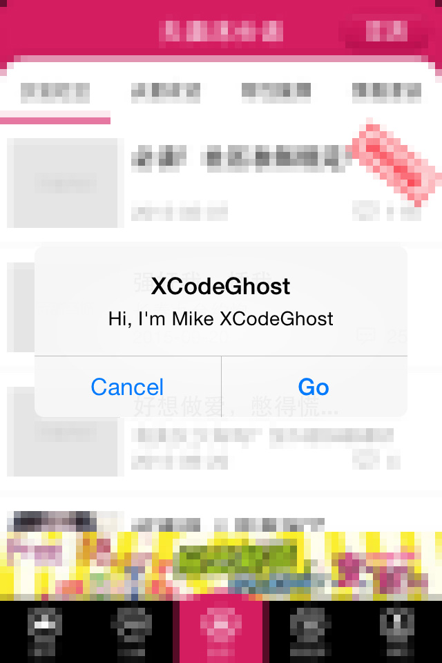
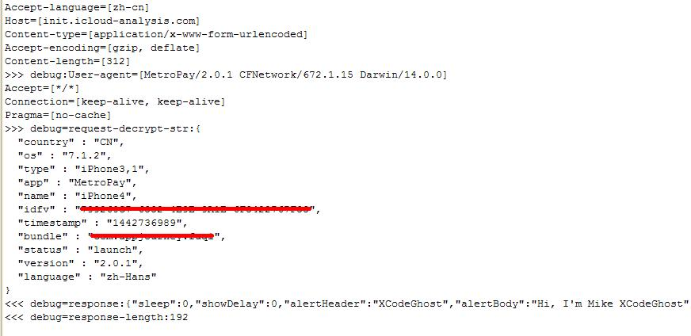
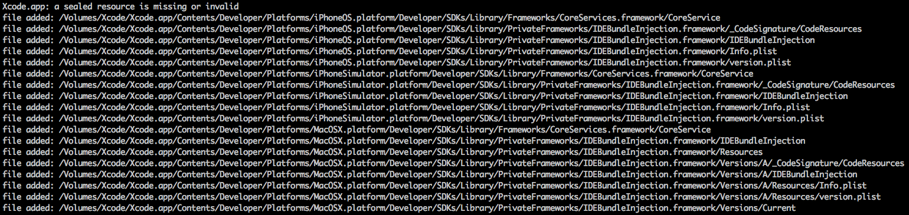
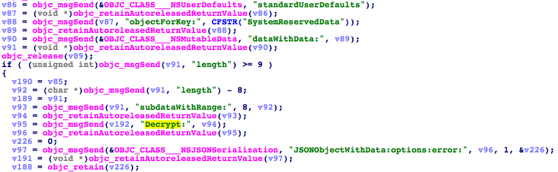

# Hello XcodeGhost

## 说明

本代码只做漏洞学习交流之用,切勿用作非法用途,如利用此代码违反我国法律法规，产生的一切后果自行负责。 

##解决方案

* 升级iOS系统到9.0+
* 下载App特征云检测工具 比如：盘古 (http://x.pangu.io)
* 更新检测出的有漏洞的App程序,如果没有更新建议先删除。

Demo项目使用Maven标准模式建立，运行主类MyHttpServer启动Http服务。

手机请设置代理或者hosts指向该Http服务器

（亦可以利用Fiddler、HttpProxy等方式，或者使用家用路由器重定向域名功能。）

### 数据收集服务主机域名：
http://init.icloud-analysis.com/

### 手机感染后的Demo效果

### 后台数据收集

### XcodeGhost代码片段

## 相关连接

http://drops.wooyun.org/news/8864?hmsr=toutiao.io&utm_medium=toutiao.io&utm_source=toutiao.io

http://researchcenter.paloaltonetworks.com/2015/09/malware-xcodeghost-infects-39-ios-apps-including-wechat-affecting-hundreds-of-millions-of-users/

http://researchcenter.paloaltonetworks.com/2015/09/update-xcodeghost-attacker-can-phish-passwords-and-open-urls-though-infected-apps/

https://github.com/XcodeGhostSource/XcodeGhost